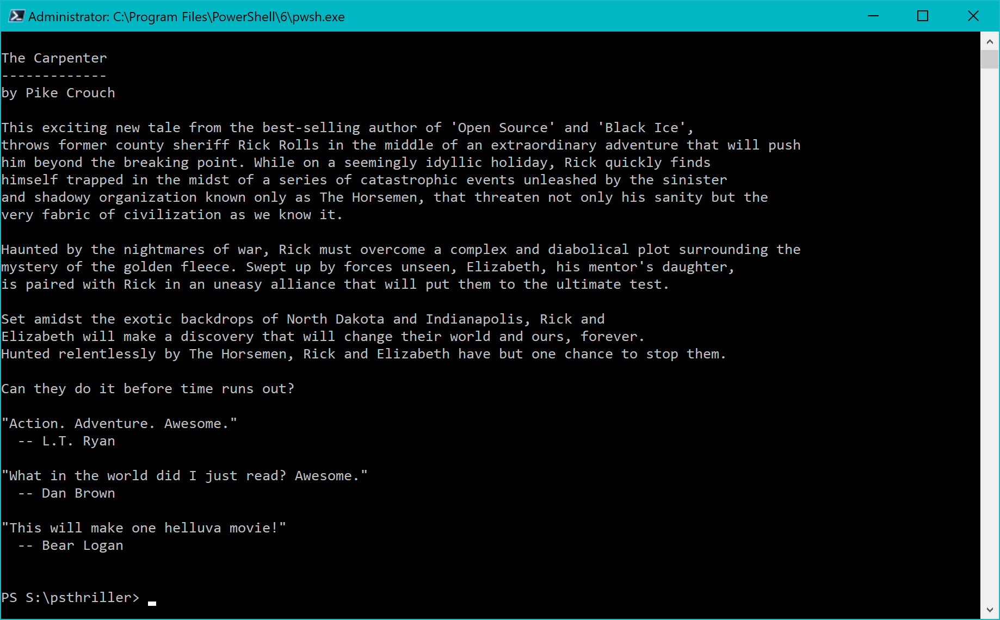
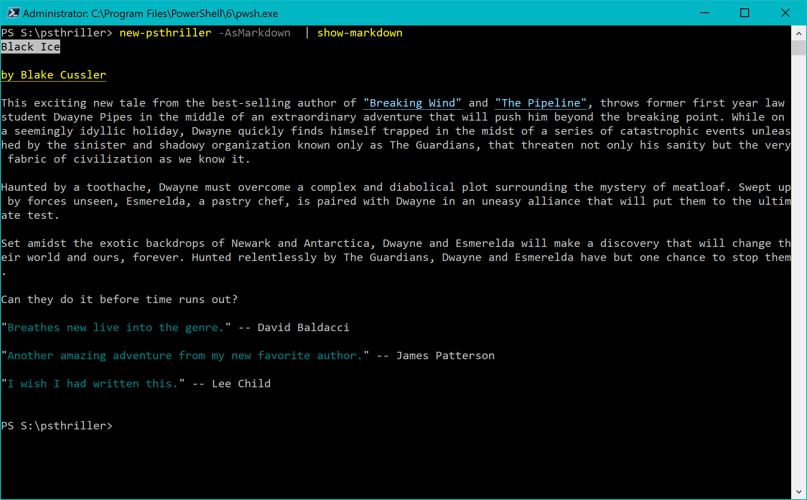

# PSThriller

This is a PowerShell module that extends the basic functionality in script called [New-Thriller](https://gist.github.com/jdhitsolutions/e65c82a86cbf144df49104e942e0da2a). The script, and this module, were never intended for serious production use. Instead, they are intended as educational tools to demonstrate a variety of scripting techniques and concepts.

This module has not been published to the PowerShell Gallery but you are welcome to download or clone for review and study.

## The Commands

The commands in this module will create output related to a hypothetical book you might write in the thriller genre. The basic premise is to take a collection of random elements and insert them into a template that describes your book, using the typical thriller formula. Think of it as a PowerShell [Mad-Libs](https://en.wikipedia.org/wiki/Mad_Libs).

> I apologize that the template assumes the protagonist is male, :curly_haired_man: but that is the trope of the genre. You might want to modify this module to be more inclusive or select different templates.

The data is stored in a [json file](./data.json) which is imported and turned into a custom object.

```text
PS C:\Scripts\psthriller> Get-Content .\data.json | ConvertFrom-Json

AuthorPool      : {Ben Coes, Vince Flynn, Brad Thor, James Rollins…}
Titles          : {The Omega Plan, Deep Rising, The Last Icon, Exit 1…}
Names           : {Tim Burr, Jack Frost, Paul Bunyan, Roy Biv…}
Formers         : {Navy SEAL, Army Ranger, NASA astronaut, space shuttle pilot…}
Villains        : {The Society, The Guild, GHOST, The Architects…}
Members         : {son, daughter, wife, mother…}
Backdrops       : {North Dakota, the Egyptian pyramids, ancient Greece,
                  Istanbul…}
LoveInterests   : {Sheila, Brandi, Betty, Layla…}
LoveBackStories : {a former student, his ex-wife, his mentor's daughter, the
                  librarian…}
Tragedies       : {the tragic loss of his _family, the nightmares of war, a
                  missing library book, a toothache…}
Mysteries       : {Clippy, Bieber Fever, Who shot J.R., the Metaverse…}
quotes          : {His best work yet!, Gripping and compelling.,
                  Breathtaking!!, I stayed up until 4 AM and then was so
                  energized I couldn't sleep.…}
```

The main command, [New-PSThriller](docs/New-PSThriller.md), gets random elements such as a title, hero name and villain, from the data and inserts them into a text template.

```powershell
...
$name = _getItem $data.names
$first = ($name | Get-Random).Split()[0]
$former = _getItem $data.formers
$villain = _getItem $data.villains
...
$text = Get-Content -path $PSScriptRoot\template.txt

[regex]$rx="_\w+"
#replace placeholders with corresponding variables
$replacements = $rx.matches($text) | Group-Object -property Value

foreach ($item in $replacements) {
    $var = (Get-Variable -Name $item.name.substring(1)).Value
    write-Verbose "[$((Get-Date).TimeOfDay)] Replacing $($item.name) with $var"
    $text = $text -replace $item.name,$var
} #foreach replacement
...
```

The default behavior is to write a custom object to the pipeline with all of the relevant book information.

```powershell
[PSCustomObject]@{
    PSTypeName = 'PSThriller'
    Title      = $Titles[0]
    Author     = $author
    Hero       = $name
    Former     = $Former
    Villain    = $villain
    TheWoman   = "$LoveInterest, $LoveBackstory"
    Locations  = $Backdrop1, $backdrop2
    Blurb      = ($Text | Out-String).Trim()
    Quotes     = $quotes
}
```

Or you can write a text document to the console.



The module should work in both Windows PowerShell and PowerShell 7. The latter includes markdown cmdlets so you can run a command like this:



Or save to a [file](sample.md).

```powershell
New-PSThriller -AsMarkdown | Out-File sample.md -Encoding utf-8
```

This module also includes commands to get 1 or more random titles with [Get-PSThrillerTitle](docs/Get-PSThrillerTitle.md)

```powershell
PS C:\> Get-PSThrillerTitle -count 5
The Meeting
Change Tracking
Running on Empty
Glock, Rock and Roll
Kill or Be Killed
```

Or use [Get-PSThrillerCharacters](docs/Get-PSThrillerCharacters.md) to generate an object.

```powershell
PS C:\> Get-PSThrillerCharacters

Hero         FormerOccupation    TheWoman HerStory        Villain
----         ----------------    -------- --------        -------
Bobby Bilder billionaire playboy Miranda  a paleobotanist The Parenthood
```

## Help :page_facing_up:

The help documentation was generated using the [Platyps](https://github.com/powershell/platyps) module, which you can install from the PowerShell Gallery.

```powershell
Install-Module Platyps
```

To use, I created a folder (\docs) for the markdown documents and a culture-specific folder (\en-us) for the final XML help file. I imported the current version of the module into my PowerShell session and generated the initial markdown documents.

```powershell
New-MarkdownHelp -Module PSThriller -OutputFolder .\docs\
```

This generated a markdown document for each public function. I edited each file filling in the blanks and adding some examples. The last step is to generate the XML file.

```powershell
New-ExternalHelp -Path .\docs\ -OutputPath .\en-us\
```

This is the process I am teaching everyone. There's really only a little bit of markdown you need to learn. The Platyps commands do all of the hard work.

## Learn :school:

Again, the purpose of this module is educational, and perhaps a little amusement. I encourage you to take the time to go through the code and see how this all works. I don't intend to publish it to the PowerShell Gallery, but I will create release files here. Or you can clone or download the repository. If you have questions, comments or any other feedback, please use the repository's Discussions section.
